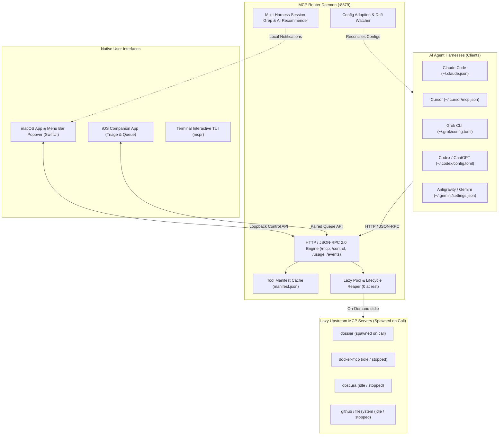
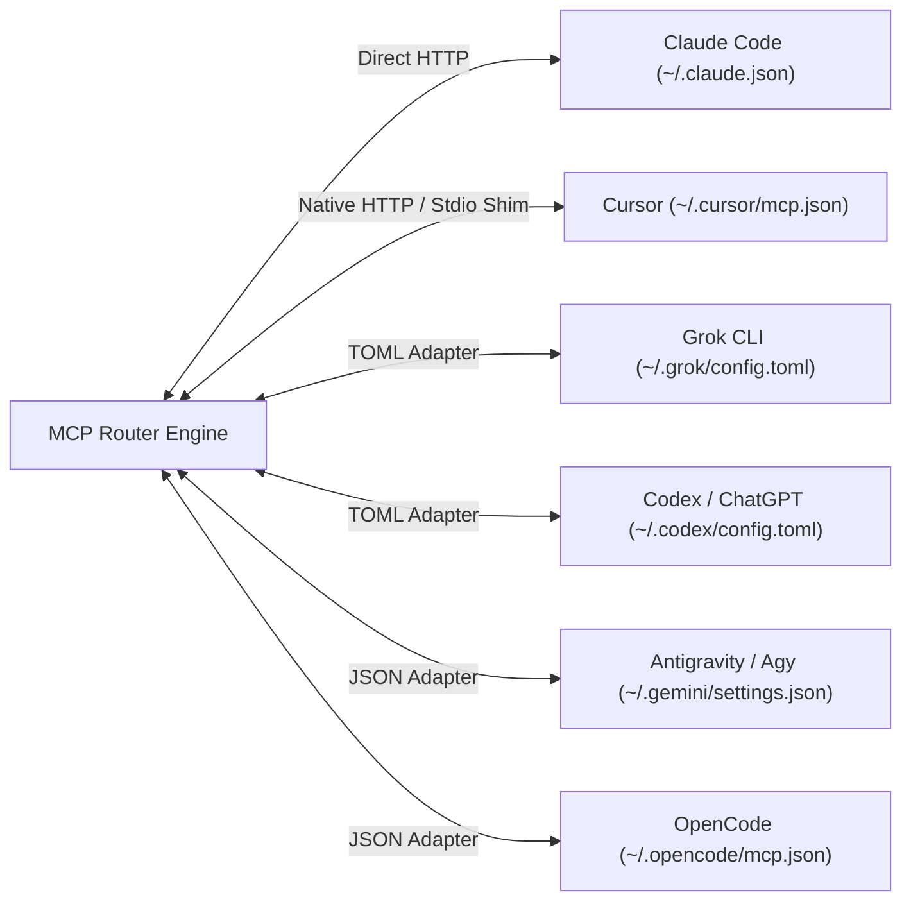
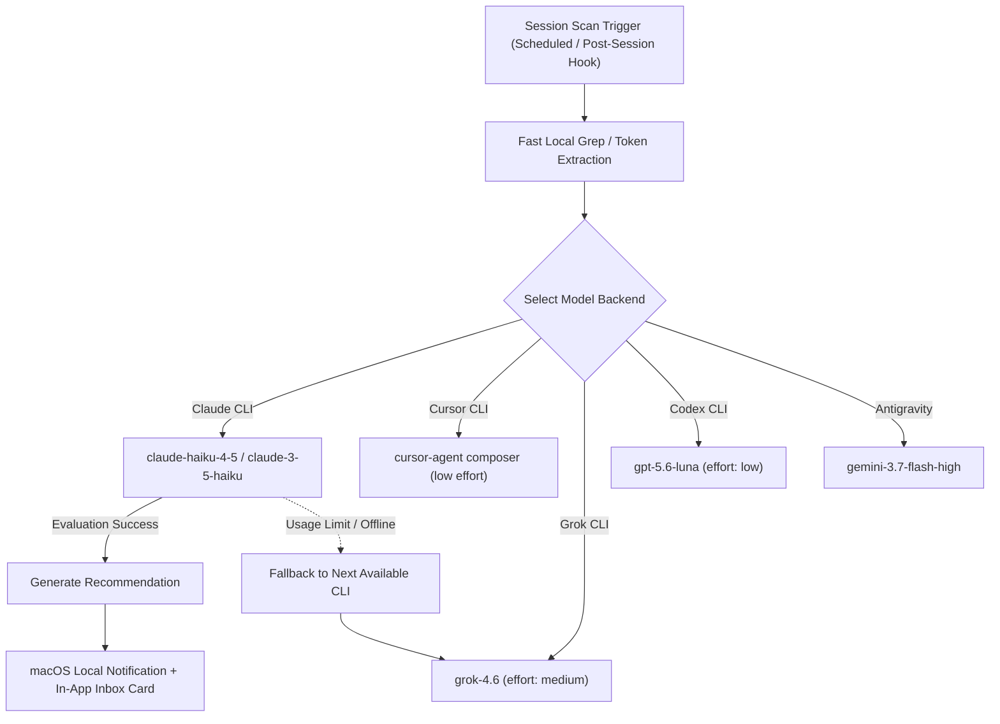
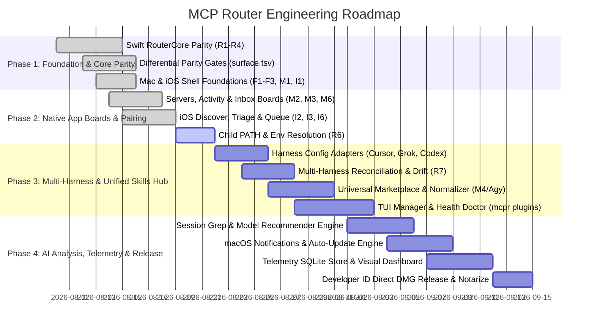

# Product Requirements Document (PRD) — MCP Router & Unified Multi-Harness Relay

**Document Version:** 2.0.0  
**Status:** Living Master Document  
**Date:** 2026-08-19  
**Repository:** `fledgeling-co/mcp-router` (`~/Dev/mcp-router`)  
**Platforms:** macOS 15+ (Native Swift / Developer ID direct distribution), iOS 18+ (SwiftUI Companion / App Store), Linux / POSIX Daemon (TypeScript reference & Swift router core), Multi-CLI Relay (`claude`, `cursor`, `grok`, `codex`/`chatgpt`, `agy`/`gemini`, `opencode`)

---

## 1. Executive Summary & Problem Thesis

### 1.1 The Problem: stdio 1:1 Pipe Explosion
The Model Context Protocol (MCP) specification models standard I/O (`stdio`) as a strictly unmultiplexed, 1:1 process pipe: one client process connects to one server process. In modern multi-session AI development environments:
- A developer running 10 concurrent AI coding sessions with 12 configured MCP servers generates **~190 child server processes** consuming **~12 GB of combined resident memory (RSS)**.
- Over 90% of declared MCP servers remain completely uncalled during typical developer sessions, yet consume resident memory, CPU cycles, file descriptors, and socket connections perpetually.
- Per-server configuration flags like `--strict-mcp-config` only limit which servers a session declares at boot; they do not share server processes across sessions or defer process startup until tool invocation.
- Multiple disparate AI harnesses on the same developer machine (`claude`, `cursor-agent`, `grok`, `codex`, `agy`/`gemini`) duplicate MCP configurations independently, compounding process sprawl exponentially.

### 1.2 The Solution: MCP Router & Unified Relay
`mcp-router` provides a shared, zero-idle-overhead HTTP MCP gateway and cross-harness skill/plugin management platform:
1. **Lazy Process Pool & Multiplexing:** Fronts all local MCP servers behind a single, stateless loopback HTTP endpoint (`http://127.0.0.1:8879/mcp`). Serves the cached tool manifest instantly at startup and spawns upstream stdio child processes *only* when a tool on that specific server is invoked.
2. **Idle Reaping:** Automatically shuts down idle server processes after a configurable timeout (default: 5 minutes) while maintaining single-flight spawn locks during burst requests. Reduces rest footprint to **0 child processes and <30 MB RSS**.
3. **Multi-AI Harness Relay:** Automatically detects, reconciles, and routes MCP tools, skills, and plugins across all major AI agent harnesses (`Claude Code`, `Cursor`, `Grok CLI`, `OpenAI Codex / ChatGPT CLI`, `Antigravity / Agy`, `OpenCode`).
4. **Universal Marketplace & Skills Hub:** Provides a single, centralized discovery and management layer for agent skills (incorporating the full feature set of `agy-plugins`), with auto-updates, Git shallow-cloning, format normalization (`AgentSkills.io v1`, Claude plugins, OpenAI skills, Grok tools), and automated health checks (`doctor`).
5. **Intelligent Session Analysis & Recommendations:** Analyzes developer prompt and tool usage history across all harness logs using lightweight CLI-native models (`haiku`, `composer`, `grok-4.6`, `gpt-5.6-luna`, `gemini-3.7-flash-high`) to recommend relevant skills and MCP servers via macOS local notifications and in-app feeds.
6. **Dual-Surface Client Experience:** Native macOS instrument-panel app with menubar popover for real-time monitoring and breaker control, paired with an iOS companion app for remote discovery, triage, and queueing.



---

## 2. Architecture & System Topology

### 2.1 Layered System Architecture
The system consists of five distinct, decoupled architectural layers:

1. **Router Core & Daemon (`RouterCore` / `src/`):**
   - Headless HTTP/JSON-RPC 2.0 and Server-Sent Events (SSE) server listening strictly on loopback `127.0.0.1:8879`.
   - Tool manifest registry and cache engine (`manifest.json`) keyed by command, arguments, and environment hash.
   - Child process pool with single-flight spawn coalescing, in-flight reference counting, and configurable idle timers.
   - Environment and login-shell PATH resolver merging user binaries (`~/.local/bin`, `~/.grok/bin`, homebrew, nvm).
   - Control REST API (`/control/*`), Usage event stream (`/usage`, `/events`), and OAuth 2.1 PKCE state machine.
   - Auto-adoption filesystem watcher monitoring harness configs and migrating stdio definitions into `servers.json`.

2. **Cross-Harness Adapter & Universal Plugin Manager (`MCPRouterKit/Plugins` & `MCPRouterCLI`):**
   - Config adapters for Claude Code, Cursor, Grok, Codex/ChatGPT, and Antigravity.
   - Central marketplace client handling GitHub repositories, shallow sparse git checkouts, and manifest indexing.
   - Normalizer converting between `AgentSkills.io v1`, `SKILL.md` frontmatter, OpenAI tool definitions, and Claude plugins.
   - Health diagnostic engine (`doctor`) detecting broken symlinks, orphaned processes, and missing environment binaries.
   - Background session log indexer with fast regex/grep analysis.

3. **macOS Native Application (`MCPRouter`):**
   - Native macOS 15+ SwiftUI application built using the *Instrument Panel* design language (`DESIGN.md`).
   - Eight specialized operational boards: **Servers (Breaker Board)**, **Activity (Live Log)**, **Skills (Marketplace Manager)**, **Discover (Catalogue Search)**, **Inbox (Remote Queue)**, **Checks (Fitness & Evals)**, **Cleanup (Unused Capabilities)**, and **Settings**.
   - Menu bar status item with dynamic attention badge, live call history, and fast approval sheet for phone queues.
   - Schema Quarantine Sheet for reviewing tool description and input schema mutations.

4. **iOS Companion Application (`MCPRouterIOS`):**
   - Native iOS 18+ SwiftUI companion application designed for mobile discovery, triage, and queueing.
   - Tabs: **Discover** (curated catalogue), **Triage** (segmented approval checklist: Undecided / Queued / Not for me), **Queue** (pending dispatch), **Library** (active servers/skills), and **Settings**.
   - Secure QR-code pairing with 6-digit cryptographic fallback.

5. **Differential Parity & Verification Harness (`scripts/acceptance/`):**
   - 83+ vector differential parity gate (`surface.tsv`) validating identical wire behavior between the TypeScript reference and native Swift router core.
   - Re-entrant file locking (`parity-lock.sh`) preventing port collisions.
   - Failure-injection test suite ensuring all assertions are demonstrably failable.

---

## 3. Platform-Specific Decisions & Technical Trade-offs

| Decision | Implementation Choice | Trade-off / Rationale |
|---|---|---|
| **macOS App Distribution** | **Direct Distribution (Developer ID + Notarized DMG)** | **Unsandboxed by necessity.** The Mac app and router daemon must spawn arbitrary developer subprocesses, execute user shell scripts, read/write dotfiles (`~/.claude.json`, `~/.cursor/`, `~/.grok/`), and control launchd agents. Apple App Sandbox forbids these capabilities; Mac App Store (MAS) is structurally incompatible. |
| **iOS App Distribution** | **App Store (Sandboxed)** | **Strictly Sandboxed.** iOS operates purely as a remote companion over local network/HTTPS. It never executes arbitrary code or spawns subprocesses locally. |
| **Remote Installation Policy** | **Phone Queues, Never Installs Directly** | **Security Boundary.** Granting a remote mobile device direct silent installation of executable code on a development laptop is a critical security vulnerability. The phone sends structured installation *requests*; the Mac requires a 1-click human approval (accelerated via notification or menubar popover per I6). |
| **Network & Loopback Security** | **Strict Loopback Binding + Host Header Validation** | **SSRF / DNS Rebinding Defense.** Binding to `127.0.0.1` alone is insufficient because malicious web pages can point a domain to `127.0.0.1`. The HTTP layer enforces that the `Host` header strictly matches `127.0.0.1:8879` or `localhost:8879`, returning `403 Forbidden` for any other host. |
| **Process Daemonization** | **macOS `launchd` Agent (`KeepAlive: true`)** | Built with native macOS `launchd` plist (`gg.rhodes.mcp-router`). Deliberately avoids `ProcessType: Background` which throttles I/O startup and causes socket listen hangs. Linux uses a standard systemd service unit. |
| **Child Process Environment** | **Login-Shell PATH Resolution (R6)** | `launchd` provides a minimal system PATH (`/usr/bin:/bin`). The router executes `$SHELL -l -c 'echo $PATH'` at startup and merges `~/.local/bin`, `~/.grok/bin`, homebrew, nvm, and cargo paths into spawned child environments so CLI-based MCP servers resolve correctly. |
| **Router Implementation Parity** | **Swift Alongside TypeScript Reference (R1–R4)** | Native Swift (`RouterCore`) replaces Node.js to eliminate runtime memory overhead and Node dependency, validated against an 83-row differential parity suite (`surface.tsv`) before cutover. |
| **Design Language & Tokens** | **Instrument Panel (Terminal Dark / Authored Light)** | Dark theme uses graphite grounds (`#1E1E1E`, `#232326`), system accents (`#0091FF`), live green (`#30D158`), attention amber (`#FF9230`), and error red (`#FF4245`). Light mode is fully re-authored with measured WCAG 4.5:1+ contrast ratios rather than color inversion. Monospace typography (`SF Mono`) is reserved strictly for instrument data. |

---

## 4. Comprehensive Feature Specifications: Implemented & Deferred

### 4.1 Router Core & MCP Proxy Layer

#### Implemented Features
- **Stateless HTTP JSON-RPC Gateway:** Implements standard MCP HTTP transport on `/mcp`. Translates HTTP POST JSON-RPC payloads into child stdio streams.
- **Manifest Disk Caching (`manifest.json`):** Cold-indexes all declared servers once at startup/registration, caches full tool schemas to disk, and serves `tools/list` instantaneously without spawning any child processes.
- **Single-Flight Lazy Pool (`src/pool.ts`, `RouterCore/Pool`):** Spawns child processes on first `tools/call`. Concurrent requests to the same cold server share a single in-flight spawn promise.
- **Idle Reaping:** Background timer tracks active in-flight calls and child idle duration. Gracefully terminates stdio children (via `SIGTERM`, falling back to `SIGKILL`) when idle exceeds `idleMs` (default 300,000 ms).
- **Tool Namespacing:** Automatically namespaces tools as `<server>__<tool>` to prevent collision across upstreams and guarantee unambiguous routing.
- **Error Containment:** A crashed or non-responsive upstream server returns an isolated JSON-RPC error response without crashing the router or affecting sibling servers.
- **Auto-Adoption Watcher (`src/watch.ts`, `RouterCore/Watch`):** Monitors harness configuration files (`~/.claude.json`). When new stdio servers are added:
  1. Spawns and indexes the server once in isolation.
  2. On success, writes the server to `~/.claude/mcp-router/servers.json`.
  3. Removes the direct entry from the client config to prevent duplicate spawns.
  4. Triggers atomic manifest reload and router restart.
  5. On failure, leaves the server in the client config with a 5-minute backoff and error log.
- **Control REST API (`src/control.ts`, `RouterCore/Control`):**
  - `GET /health` — Router status, PID, uptime, active server count.
  - `GET /status` — Detailed metrics: running children, memory RSS, idle timers, in-flight calls.
  - `GET /servers` — Enumerates all configured, running, and quarantined servers.
  - `POST /servers/:id/toggle` — Manual breaker toggle (start / stop server).
  - `GET /usage` & `GET /events` — SSE stream of real-time tool calls, latency, payload sizes, and errors.
  - `GET /registry/search` — Merged Smithery and official MCP registry catalogue search.
- **OAuth 2.1 Authentication Flow (`src/auth.ts`, `RouterCore/Auth`):** Full PKCE authorization code flow handling for upstreams requiring user authentication.

#### Deferred & Triage Register Items
- **R6 (Child Process PATH):** Resolve and inject full login-shell PATH into all child processes; surface distinct error when a server's binary is missing from PATH.
- **R7 (Multi-Harness Reconciliation):** Audit and eliminate duplicate direct stdio servers across Gemini, Codex, Cursor, and Grok.
- **P1 (Auth Routes Reachability):** Make `/auth/start` and `/auth/callback` fully parity-proven against OAuth mock fixtures.
- **P2 (Import Verb):** Implement CLI and API `mcpr import` to re-scan and adopt updated harness files atomically.
- **D1-Router (Deferred Router Children):** Fixed-port harness locking (`parity-lock.sh`), defect seeding for parity testing, socket-level control API differential validation.

---

### 4.2 macOS Native Application (`MCPRouter`)

#### Implemented Features
- **Window Shell & Navigation (`M1`):** Native macOS three-column layout with 256pt sidebar, collapsible sections, system-standard toolbar, and full keyboard navigation (arrows, `⌘1`–`⌘9`, `⌘,` for Settings, `Tab`, `Space`, `Enter`). The board map is §9.4.
- **Servers Board / Breaker Board (`M3`):**
  - Real-time visual breaker levers for every configured server.
  - Breaker snaps to `UP` (Live Green indicator) when called by an agent session and eases to `DOWN` when reaped.
  - Manual override toggle to trip/disable any server immediately.
  - Detail pane showing tool counts, schema sizes, child process PID, RSS memory, idle countdown, and error logs.
- **Activity Board (`M2`):**
  - Live streaming log of every MCP tool invocation across all client sessions.
  - Filterable by server, client harness, status (success / error), and latency threshold.
  - Inspector pane rendering JSON-RPC input parameters, return values, execution duration, and caller session ID.
- **Skills Board (`M4`):**
  - Displays all installed agent skills across harnesses with versioning, origin marketplace, and client slot indicators.
  - Auto-update toggles and changelog inspection.
- **Discover Board (`M5`):**
  - Searchable catalogue aggregating official MCP servers and community registries.
  - One-click install with automatic configuration generation and tool schema pre-caching.
- **Inbox Board & Pairing (`M6`):**
  - Manages remote requests queued from paired iPhones.
  - Displays queued capabilities, tool schemas, and one-click Accept / Dismiss actions.
  - Pairing sheet with dynamic QR code generation, local TLS certificate exchange, and 6-digit manual fallback code.
- **Checks & Evals Board (`M7`, `M9`):**
  - Fitness testing interface to execute eval suites against installed skills and servers.
  - Version-pinned eval history preventing stale capability claims.
- **Cleanup Board (`M7`):**
  - Unused capability analyzer highlighting installed tools that have recorded 0 invocations over 7d/30d/90d windows.
  - Non-destructive dismissal and clean uninstallation.
- **Settings & Quarantine (`M8`):**
  - Configures router listening port, idle reap intervals, warm server sets, and control auth tokens.
  - Schema Quarantine review sheet alerting the user when an upstream server silently modifies its tool descriptions or input schemas between versions.
- **Menu Bar Popover & Status Item (`M8`, `I6`):**
  - Persistent macOS menu bar item displaying real-time status dots (Green = active, Amber = pending approval/quarantine).
  - Popover showing active server counts, last 6 tool calls, and an inline **Fast Approval Band** for phone queue arrivals.

#### Specified by the mock, not yet built

Everything in this list is drawn in `design/mcp-router-console.html` and detailed in §9. None
of it is implemented; each carries a triage brief under `planning/features-to-triage/`.

- **Settings becomes its own window (`M15`).** Seven panes in a source list, greyed
  minimise/zoom, reached from the app menu rather than the console's navigation list. Replaces
  the Settings *board* described above.
- **The Signal Path replaces the Breaker Column (`M16`).** A left-to-right patchbay across the
  head of the Servers board. Supersedes M3's signature element; M3's state-correctness rules
  survive unchanged.
- **Four states on every surface, and chrome that follows them (`M17`).** 40 cells across nine
  boards and the Settings window, with the toolbar subtitle, sidebar tallies and health card
  bound to the state on screen.
- **Twelve sheets and a proportional gate per destructive action (`M18`).**
- **The in-app GitHub-flavoured Markdown viewer (`M19`).** Read me / Changelog / Capabilities
  tabs, shields, tables, fenced code, blockquotes and inline figures. Delivers §7.2.
- **Menu bar, status item and notification banner (`M20`).** Nine menus with accelerators, the
  popover's fast-approval band, and the banner's three actions with a reachable live region.
- **The token layer and the split accent (`M21`).** 89 tokens, six appearance contexts, and the
  reconciliation of `DESIGN.md` with the direction §9.1 records.
- **The Harnesses and Insights boards (`M22`).** Two surfaces with no prior brief: the harness
  reconciliation surface R7 argues for, and the counted-usage board §8.2 specifies.

#### Deferred & Triage Register Items
- **D2-Mac (Deferred Mac Surfaces):** Top-alignment layout fixes across all boards, nested scroll area cleanup on Settings board, menu command validation (`M14`), and token verification.
- **I6 (Arrival Notifications):** macOS native user notification dispatch upon receiving a queue request from a paired phone, with direct action buttons ("Approve", "Review", "Dismiss").

---

### 4.3 iOS Companion Application (`MCPRouterIOS`)

#### Implemented Features
- **Phone Shell & Design Foundation (`I1`):** Native iOS 18 SwiftUI application conforming to Apple Human Interface Guidelines.
- **Pairing Experience (`I1`):** Fast camera QR code scanner with animated viewfinder, instant cryptographic key exchange, connection state indicator (Connected / Unreachable / Expired), and manual code entry fallback.
- **Discover & Detail (`I2`):**
  - Mobile registry browser with categorized sections (Featured, Developer Tools, System Utilities, AI Workflows).
  - Full capability transparency sheet detailing every tool name, required permissions, and environment variables before sending.
  - "Send to Mac Queue" action with haptic confirmation.
- **Triage Checklist (`I3`):**
  - Structured checklist layout with segmented buckets: **Undecided**, **Queued**, and **Not for Me**.
  - Color-coded security summaries and expandable capability lists.
- **Queue Management (`I3`):** Live view of pending items awaiting Mac approval, with cancellation and priority ordering.
- **Library View (`I3`):** Read-only mirror of all active MCP servers and skills on the paired Mac.

---

## 5. New Capability: Multi-AI Harness Selection & Unified Relay Adapter

### 5.1 Overview
The MCP Router serves as the single source of truth and unified relay for all AI agent harnesses installed on the developer's workstation. Rather than requiring distinct plugins, duplicate configs, or separate background processes for each harness, MCP Router orchestrates them centrally.

### 5.2 Supported Harnesses & Configuration Adapters



1. **Claude Code (`claude`):**
   - Config file: `~/.claude.json` / `~/.claude/settings.json`
   - Integration: Native HTTP MCP transport (`"type": "http"`, `"url": "http://127.0.0.1:8879/mcp"`).
   - Skills directory: `~/.claude/skills/`

2. **Antigravity / Agy (`agy`, `gemini`):**
   - Config file: `~/.gemini/settings.json` / `~/.agy/config.json`
   - Integration: Native HTTP endpoint or zero-overhead stdio relay.
   - Plugin/Skill location: `~/.gemini/plugins/`, `~/.agy/skills/`

3. **Cursor (`cursor`, `cursor-agent`):**
   - Config file: `~/.cursor/mcp.json`
   - Integration: Native HTTP endpoint (`mcpServers.mcp-router = { "url": "http://127.0.0.1:8879/mcp" }`) or stdio bridge.
   - Skills directory: `~/.cursor/skills/`

4. **Grok CLI (`grok`):**
   - Config file: `~/.grok/config.toml`
   - Integration: `[mcp_servers.mcp-router]` block pointing to loopback relay.
   - Plugins directory: `~/.grok/installed-plugins/`

5. **OpenAI Codex / ChatGPT CLI (`codex`, `chatgpt`):**
   - Config file: `~/.codex/config.toml` / `~/.codex/plugins/`
   - Integration: `[mcp_servers.mcp-router]` HTTP configuration.
   - Skills directory: `~/.codex/skills/`

6. **OpenCode (`opencode`):**
   - Config file: `~/.opencode/mcp.json`
   - Integration: HTTP JSON-RPC endpoint.

---

### 5.3 Universal Marketplace & Skills Management (Incorporating `agy-plugins` Architecture)

The router incorporates and expands upon all architectural features of `agy-plugins`:

1. **Central Marketplace Registry:**
   - Add, remove, update, and browse GitHub-hosted skill repositories (e.g. `fledgeling-co/fledgeling-plugins`, `DiologIR/diolog-plugins`).
   - Supports `AgentSkills.io v1` specification, Claude plugins (`plugins/`), OpenAI Codex skills (`skills/`), and custom agent definitions.

2. **Universal Skill Normalizer (`normalizer.ts` / `Normalizer.swift`):**
   - Parses heterogeneous skill formats (`SKILL.md` frontmatter, `.claude/commands/`, `agents/*.md`, OpenAI tool definitions).
   - Generates standardized skill metadata: name, description, parameters, triggers, dependencies, and required runtime binaries.

3. **Smart Partial Git Syncing (Sparse / Shallow Download):**
   - Avoids cloning multi-gigabyte git histories.
   - Uses sparse git checkouts (`git clone --filter=blob:none --no-checkout` / `git sparse-checkout set <skill-path>`) to download only the requested skill folders, cutting disk usage by **>95%**.

4. **Zero-Dependency Lightweight Core:**
   - Built on native Node.js and Swift platform libraries without external runtime bloat.

5. **Multi-Interface Access:**
   - **Interactive Terminal TUI:** Keyboard-driven manager (`mcpr plugins` / `agy-plugin`) with live filtering, space-to-toggle, and tab switching (Explore, Marketplaces, Installed, Doctor).
   - **macOS & iOS GUI:** Dedicated Skills board with multi-harness deployment matrix.
   - **CLI Shortcuts:** `mcpr plugin install <name>@<repo>`, `mcpr plugin update`, `mcpr plugin doctor --fix`.
   - **Stdio & HTTP MCP Tools:** Exposes meta-tools (`install_skill`, `uninstall_skill`, `list_skills`, `search_skills`, `doctor`) allowing AI agents to self-install tools when requested by the user.

6. **Automated Doctor & Diagnostics (`doctor.ts`):**
   - Automatically detects broken symlinks, missing environment variables, missing executable dependencies (`python3`, `node`, `docker`, `git`), and corrupted caches.
   - Provides 1-click automatic remediation (`--fix`).

7. **Config Reconciliation & Drift Detection (Addressing R7):**
   - Scans all installed harness configuration files on startup and at scheduled intervals.
   - Identifies direct stdio servers that duplicate tools already served by `mcp-router`.
   - Generates a clear diff and prompts the user to adopt and reconcile entries into the router, eliminating redundant background processes across all CLIs.

---

## 6. Intelligent AI Session Analysis & Skill Recommendations

### 6.1 Feature Overview
An intelligent background analyzer that periodically reviews user prompts, agent tool executions, and error logs across all installed harness sessions. When it detects repetitive manual terminal operations, missing capabilities, or sub-optimal workflows, it recommends relevant skills or MCP servers to install.

### 6.2 Multi-Harness Session Ingestion & Grep Engine
The analysis engine performs rapid, lightweight regex and JSONL scanning across local session stores:

| Harness | Session Log Location | Format | Grep / Extraction Target |
|---|---|---|---|
| **Claude Code** | `~/.claude/history.jsonl`, `~/.claude/projects/*/` | JSON Lines | User prompts, tool calls, bash commands, error outputs |
| **Cursor** | `~/.cursor/chats/`, `~/.cursor/projects/*/` | JSON / SQLite | Composer prompts, editor terminal commands, extension errors |
| **Grok CLI** | `~/.grok/sessions/*.jsonl`, `~/.grok/memtrace/` | JSON Lines | Chat turns, tool executions, shell fallbacks |
| **Codex / ChatGPT** | `~/.codex/history.jsonl`, `~/.codex/logs_2.sqlite` | SQLite / JSONL | Prompts, agent loops, python/bash execution logs |
| **Antigravity / Gemini** | `~/.gemini/history/`, `~/.gemini/settings.json` | JSON Lines | Session turns, tool invocations, bash logs |

### 6.3 Harness-Native Model Selection & Fallback Hierarchy
To preserve user cost preferences and utilize existing CLI credentials without requiring direct API keys, analysis tasks run through the user's installed CLI binaries using fast, cost-effective models:



- **Configurable Hierarchy:** The user selects their **Primary Analyzer CLI** and **Fallback Analyzer CLI** in Settings (e.g. Primary: Claude `haiku`, Fallback: Grok `grok-4.6`).
- **Prompt Structure:** Summarized session excerpts (e.g. repeated git merge conflicts, manual Docker log debugging, recurring web search patterns) are evaluated against the global skills/servers index.
- **Deduplication:** Recommendations are fingerprinted; identical suggestions are suppressed for 30 days unless triggered by a new explicit failure pattern.

### 6.4 Notification & Delivery Mechanism
1. **macOS Native Local Notification (`UserNotifications`):**
   - Title: `New AI Skill Recommendation`
   - Body: `We noticed you frequently run manual Docker inspections. Install 'docker-mcp' to let your AI handle this directly?`
   - Actions: `[Install Now]` `[View Details]` `[Dismiss]`
2. **In-App Inbox & Announcements Card:**
   - Rich recommendation card in the Mac App Inbox and iOS Companion Triage view.
   - Displays the detected session trigger, tool capabilities, star count, and a 1-click install button.

---

## 7. Auto-Updates, Markdown & Rich Media Asset Viewer

### 7.1 Auto-Update Lifecycle
- **Configurable Intervals:** Background check interval configurable to **1 hour**, **6 hours**, **12 hours**, **24 hours**, or **Manual**.
- **Non-Disruptive Live Symlinks:** Updated skill versions are pulled into isolated directory targets (`~/.claude/plugins/cache/<id>/<version>`) and symlinked atomically, updating live sessions immediately without requiring router restarts.
- **Trust Decay & Capability Quarantine:** If a skill or server update requests new system capabilities (e.g. new network endpoints, new file write access, or modified tool input schemas), the update is quarantined in **Shadow State** until the user reviews and approves the delta in the app.

### 7.2 In-App Rich Content & Asset Rendering
Both the macOS and iOS applications integrate a rich media rendering pipeline:
- **GitHub-Flavored Markdown (GFM):** Complete parsing of READMEs, CHANGELOGs, and skill documentation with full support for tables, blockquotes, syntax-highlighted code fences, and collapsible `<details>` blocks.
- **Live Version Diffs:** Visual side-by-side or unified diffs for CHANGELOG updates and schema mutations.
- **Rich Media & Badges:** Inline rendering of SVG badges, shields, architecture diagrams, and high-resolution PNG/WebP banner graphics directly within the skill detail view. `M19` specifies the renderer, including the two constraints that shape it: a README is untrusted input from a marketplace, and `AttributedString(markdown:)` covers inline runs but not tables or fenced code blocks.

---

## 8. Usage History, Telemetry & Cross-Harness Analytics

### 8.1 Usage History & Event Capture
- Every tool invocation across all client sessions is streamed through `/events` and committed to an embedded local SQLite log store (`~/.claude/mcp-router/history.sqlite`).
- **Exact Version Tracking:** Captures and records the exact semantic version and Git commit SHA of the server and skill active at the exact moment of execution.
- **Telemetry Schema:**
  - `id` (UUIDv7, time-ordered)
  - `timestamp` (ISO-8601 UTC)
  - `server_id` (e.g. `dossier`, `github`, `docker-mcp`)
  - `tool_name` (e.g. `research_plan`, `create_container`)
  - `skill_id` (optional, e.g. `trawl@fledgeling-plugins`)
  - `skill_version` (e.g. `1.4.2@a3f890b`)
  - `client_harness` (`claude`, `cursor`, `grok`, `codex`, `agy`)
  - `session_id` (caller session identifier)
  - `duration_ms` (execution latency)
  - `status` (`success`, `error`, `timeout`, `quarantined`)
  - `payload_bytes_in` / `payload_bytes_out`
  - `error_code` / `error_message`

### 8.2 Interactive Visualizations & Dashboards
The macOS app, iOS app, and web dashboard render real-time interactive telemetry visualizations.
The sketch below records the data; **§9.4 and `M22` are the authority on what the Insights board
actually renders**, including which token each bar fill takes and why a zero-valued row must still
appear.

```
+---------------------------------------------------------------------------------------+
|  MCP ROUTER - SYSTEM TELEMETRY & SAVINGS                                              |
+---------------------------------------------------------------------------------------+
|  ACTIVE CHILD PROCESSES       RESIDENT MEMORY (RSS)           TOTAL INVOCATIONS (24H) |
|  [ 0 at rest / 1 peak ]       [ 28 MB vs 12.4 GB unrouted ]   [ 1,482 calls ]         |
|  Savings: 99.8% processes     Savings: 99.7% RAM              Error Rate: 0.13%       |
+---------------------------------------------------------------------------------------+
|  SERVER BREAKER ACTIVITY & DUTY CYCLE                                                 |
|  dossier     [====|            ]  42 calls  (avg 1.2s)   Last: 3m ago  [ACTIVE]       |
|  docker-mcp  [==|              ]  18 calls  (avg 450ms)  Last: 14m ago [IDLE]         |
|  obscura     [========|        ]  94 calls  (avg 2.8s)   Last: 1m ago  [ACTIVE]       |
|  google-srch [=============|   ] 142 calls  (avg 620ms)  Last: 12s ago [ACTIVE]       |
+---------------------------------------------------------------------------------------+
|  INVOCATIONS BY AI HARNESS                                                            |
|  Claude Code  [████████████████████████░░░░░░░░] 64%                                  |
|  Cursor       [████████░░░░░░░░░░░░░░░░░░░░░░░░] 21%                                  |
|  Grok CLI     [███░░░░░░░░░░░░░░░░░░░░░░░░░░░░░]  9%                                  |
|  Codex/ChatGPT[██░░░░░░░░░░░░░░░░░░░░░░░░░░░░░░]  6%                                  |
+---------------------------------------------------------------------------------------+
```

1. **Memory & Process Virtualization Savings:** Real-time counter showing cumulative RAM and process savings achieved by lazy multiplexing compared to standard 1:1 stdio allocation.
2. **Breaker Timeline & Duty Cycle:** Visual timeline showing server spin-up events, active execution duration, and idle reap timestamps.
3. **Cross-Harness Distribution:** Breakdown of tool requests across client harnesses.
4. **Latency & Error Heatmaps:** Interactive performance charts highlighting slow tools or intermittent upstream failures.

---

## 9. User Interface Design & Visual System

This section is derived from the interactive macOS mock at `design/mcp-router-console.html`,
which is the authority on everything below. Its delivery note —
`design/mcp-router-console-spec.md` — carries the audit numbers, the provenance of each
metric, and the list of what was specified rather than measured.

### 9.1 Design direction: Patchbay

The subject is a signal router, so the design language is taken from routing hardware rather
than from dashboard convention. The ground is white with a graphite chrome step, the system
accent carries selection and focus, and three indicator hues each carry a text-safe twin.
Type is the platform stack (`-apple-system`), with `ui-monospace` reserved for anything the
user could paste into a terminal: commands, paths, tool names, durations, hashes. There is no
display face. An app that rewrites `~/.claude.json` earns trust by looking like the system.

**This supersedes the *Instrument Panel* direction** recorded in `DESIGN.md` — Terminal Dark
with a Breaker Column signature. The two documents now disagree, and `DESIGN.md` has not been
re-authored; until it is, the mock and this section are the authority and `DESIGN.md` is
historical. Resolving that is tracked as M21.

The runner-up direction was *Blueprint Graphite*, a dark technical drawing with hairline rules
and a cyan annotation layer. It was set aside because the prior direction was already dark
graphite, so it would have read as a re-skin rather than a decision, and because the densest
reading surfaces — Harnesses, Cleanup, Checks — are easier on a light ground.

### 9.2 Signature element: the Signal Path

The Servers board opens with a patchbay that reads left to right: the harnesses that are
wired, one endpoint, and every upstream the router fronts. Each upstream is a **jack** on a
44px lane whose plug lights the moment something calls it and goes dark when the reaper closes
the child. The hub between them carries the product's thesis as a literal readout —
`Router :8879 · 0 at rest`.

State is never carried by colour alone. Each jack names its condition in words beside the
plug (`3:41 left`, `tripped`, `2 held changes`, `needs sign-in`), and the border changes with
it. Clicking a jack selects that server in both the table and the inspector.

The metaphor is load-bearing rather than decorative: the plug states are the router's real
child lifecycle, the arrow count is the measured topology, and `0 at rest` is a number the
router observes. If the pooling model changes, the signature changes with it.

### 9.3 Window anatomy

| Element | Value | Provenance |
|---|---|---|
| Window | up to 1320 × 860, radius 12 | direction |
| Unified toolbar | 52px | kit |
| Titlebar (sheets, Settings) | 33px | kit |
| Source list | 256px, rows 32px, selection radius 8 inset 4px | kit |
| Inspector pane | 340px, collapsible via `⌥⌘I` | direction |
| Card radius | 10px | corpus |
| Body type | 13px | kit |
| Control tiers | 16 / 20 / 24 / 28 / 36px | kit |
| Spacing unit | 8px | direction |

The toolbar carries the traffic lights, the sidebar toggle, a title and a subtitle that both
track the current board, a search field, and three trailing actions. The source list groups
its rows under three sentence-case headers — Routing, Library, Attention — and ends with a
health card reporting what the router is doing right now.

### 9.4 Navigation and board map

Nine boards, each reachable by accelerator and from the View menu:

1. **Servers (`⌘1`)** — the Signal Path, the held-schema band, and the full upstream table with
   its inspector. Beside an open inspector the table drops its two least load-bearing columns
   rather than clipping the ones it keeps.
2. **Activity (`⌘2`)** — the live call log, filterable by harness and by outcome, with a
   per-call inspector breaking latency into spawn, queue and upstream.
3. **Harnesses (`⌘3`)** — every harness detected on the machine, its config path and version,
   how it currently reaches the router, and what it duplicates. This is the surface R7 exists
   for.
4. **Skills (`⌘4`)** — installed skills with a per-harness slot matrix, marketplaces, and
   updates, with provenance and use-by-version in the inspector.
5. **Discover (`⌘5`)** — the merged catalogue across indexes, with each row naming which index
   supplied it.
6. **Inbox (`⌘6`)** — everything waiting on a decision: what the phone queued, and what the
   session analyst noticed. Nothing here has been installed.
7. **Insights (`⌘7`)** — counted usage and the analyst's own configuration.
8. **Checks (`⌘8`)** — capability check suites, scoped to the version they ran against.
9. **Cleanup (`⌘9`)** — installed and unused capabilities, with the argument for keeping each
   one.

`⌘0` and `⌘,` open Settings, which is a window rather than a board (§9.5).

### 9.5 Settings is a separate window

Settings has its own window with its own source list of seven panes: Router, Harnesses,
Session analyst, Updates, Security, Menu bar, Advanced. Seven is past the point where a
preferences tab bar works, which is what makes a sidebar correct here rather than merely
available.

Three properties identify it as a settings window rather than a second document window, and
all three are built: **minimise and zoom are greyed while close stays live**; it is reached
from the app menu, `⌘,` or the Window menu, never from the console's navigation list; and it
has no Save button, because every control applies on change.

Each pane opens with its name and one line saying what it governs, then grouped inset cards —
label left, control right on a shared axis, inset hairlines between rows, native capsule
switches and pop-up buttons. While the Settings window is frontmost it owns its own state; the
console's toolbar and tallies are left alone.

### 9.6 Every surface carries four states

Ten surfaces — the nine boards and the Settings window — each carry **ideal, empty, loading and
error**, for 40 built cells. Each cell carries copy written for that surface: Discover's empty
state names the query that returned nothing, Checks' error names which two of eleven checks
failed, Insights' error says the primary analyst hit its usage limit and the fallback ran.

The chrome follows the state rather than contradicting it. The toolbar subtitle changes, the
sidebar tallies hide, and the health card cannot report "Router serving" over a board that
says the router is unreachable.

A loading state is designed rather than stubbed: determinate progress where a count is known,
a live line naming what is being read, and skeleton rows matching the shape, size and ground
of the content they stand in for.

### 9.7 Sheets, and the gate each decision gets

Twelve sheets, each carrying one decision together with the evidence for it: pair, reconcile,
quarantine, readme, capability-delta, add-server, add-marketplace, recommendation,
queued-detail, analyzer, path, confirm-remove.

Friction scales with blast radius. No action is gated by a toast alone, and no reversible
action asks for confirmation.

| Action | Blast radius | Gate |
|---|---|---|
| Remove duplicate entries from a harness config | someone else's file | full unified diff, before/after counts, "Open the file instead", named-consequence button |
| Remove selected capabilities | installed capability | multi-select, named count, 30-day undo stated on the surface |
| Accept held schema changes | a tool regains callability | schema diff and description diff, with the reason it was held |
| Disable a server | one server stops answering | quiet destructive-red text button, never the primary |
| Trip breaker / wake now | one child process | none — reversible in one press, and the state is visible |
| Approve a phone-queued install | executable code on this Mac | the phone queues; the Mac shows tools and capability summary and asks |
| Stop Router | every session loses its tools | menu item, no accelerator |

### 9.8 Menu bar, status item and notification

The app ships nine menus — Apple, MCP Router, File, Edit, View, Router, Library, Window, Help —
with real accelerators, Title Case items, and disabled items dimmed in place with their reason
in the shortcut column rather than hidden.

The **menu-bar extra** is a template symbol that takes an amber dot only while something wants
a decision. Its popover answers one question and closes: what is running, what the phone
queued, and the last six calls with their outcomes. The queued item carries Approve, Review…
and Not now inline, so a decision that would otherwise need the main window takes one press.

The **notification banner** is the delivery mechanism for an analyst finding (§6.4). It carries
the finding in one sentence with the evidence count, and three actions: Install, Details,
Dismiss. The announcement for assistive technology is a permanent clipped live region written
into when the banner fires, because a live region holding its own buttons is flattened to plain
text and the buttons become unreachable.

### 9.9 Colour and type tokens

Every colour lives in a custom property; there are 89 in the token block and no colour literal
outside it. Six appearance contexts are authored: light, dark, an explicit light and dark
override for the in-app switch, and **two separate increased-contrast blocks**, because one
scheme-agnostic `prefers-contrast` block paints dark ink on a graphite ground in whichever of
the two it was not written for.

The accent is split, and the reason is measured. Apple's published system Blue `#0088FF`
gives 3.52:1 against white, below the 4.5:1 floor for 13px text. `--accent` therefore stays
the published hue for rings, plugs and tints, and `--accent-ink` (`#0071E3` light, 4.70:1;
`#0A6FD6` dark, 4.93:1) carries any accent surface with text on it. Every indicator hue has
the same twin — `--live-ink`, `--attn-ink`, `--fail-ink` — each solved against all three
grounds, plus `--shield-good` and `--badge-bg` for the two filled badges that carry white.

### 9.10 Accessibility floor

- Contrast is gated across all four appearance contexts. The current measurement is
  **5,788 pairs, 0 failures, 0 unresolved**; disabled-tier text is exempt under WCAG 1.4.3
  incidental.
- `:focus` is reset once and replaced by a `:focus-visible` ring bound to the accent, inset on
  rows and jacks so it reads inside a selection fill.
- Every control is a real `<button>` or carries a role, `tabindex` and key handling; there are
  no clickable non-semantic elements.
- `prefers-contrast`, `prefers-reduced-motion` and `prefers-reduced-transparency` are all
  authored. They are specifications rather than measurements — the sanctioned browser accepts
  `Emulation.setEmulatedMedia` and does nothing, so no media-query pass has been rendered.
- Colour is never the only signal. Every jack, row and badge names its state in words.
- No `cursor: pointer` anywhere; the hand cursor is the non-native tell an experienced Mac user
  names first.

### 9.11 What the mock does not settle

- **`DESIGN.md` still describes the superseded direction.** Until it is re-authored the two
  disagree, and any implementer reading `DESIGN.md` alone will build the wrong thing.
- **Motion is specified, not measured.** The jack transitions, sheet entry, banner slide and
  skeleton shimmer have durations and easings in the file; no rendering engine available here
  executes CSS animation, so none has been observed.
- **Type fidelity is unmeasured** — no web fonts load in the capture engine, so the
  `-apple-system` stack is a source claim about what a Mac would resolve.
- **Five of the seven Settings panes, nine boards in dark appearance, and both
  increased-contrast appearances have never been rendered.** The state grid was verified
  structurally in the DOM and by reading every variant's copy rather than by capturing all 40
  cells.
- **The mock is a single-window fiction of a multi-window app.** Sheets, the Settings window
  and the notification are drawn in one page, so window layering, focus transfer between
  windows, and sheet-to-parent attachment are approximated.


### 9.12 Converting the mock to SwiftUI

The mock is an HTML artifact and the product is a SwiftUI app, so the conversion is the project's
central engineering risk rather than a transcription step. `M23` is the contract; this records the
shape of it, because a reader of the PRD needs to know that "matches the mock" is a measured claim
here rather than an opinion.

SwiftUI has no DOM. Nothing outside the process can read a view's resolved foreground colour, and
by the time a view is on screen its modifiers have been resolved away — the same position React
Native is in, and the reason the web fidelity playbook does not transfer. The conversion is
therefore proved in five layers, each with its own artifact:

| Layer | Mock side | SwiftUI side | What it catches |
|---|---|---|---|
| Tokens | the `:root` block and the `mac-craft:metrics` comment | `ColorToken`, `TypeToken`, `MetricToken` | systematic offsets a single element hides |
| Structure | the parsed DOM tree | the running app's accessibility tree | missing, substituted, relocated, reordered |
| Resolved style | `getComputedStyle` | a dev-only in-app measurement harness | colour, font, radius, spacing drift |
| Copy | the mock's text nodes | the `*Copy` enums | placeholder text, missing unhappy-path sentences |
| Pixels | screenshot | `XCTAttachment` bitmap | supplementary only, never the evidence |

Three rules make those layers load-bearing rather than decorative, and all three come from
measurement rather than preference:

1. **Breadth before depth.** Every affordance the mock shows gets a present / divergent / absent
   row before any style finding is read. A style differ only compares elements existing on both
   sides, so a clean findings list says nothing about a missing one.
2. **A difference is a defect until an external, pre-existing citation proves it intentional.** A
   justification composed during the audit is motivated classification, and it is the most common
   way drift ships.
3. **A check that cannot run is not a check that passed.** The gate returns inconclusive as a third
   state, and each silenced layer gets a row saying where it was confirmed instead.

The repo already has most of the token layer: `DesignDocParser` reads token tables out of a
document and `DesignTokenParityTests` compares them to the Swift types. That machinery is correct
and stays; it needs re-keying from `DESIGN.md` to the mock, which is the open decision in §9.11 and
`M21`.

The method is not invented here. It is `mockup-fidelity`, vendored into this repo as a git
submodule at `.claude/plugins/fledgeling-plugins` so a runner working in this tree can read it at a
repo-relative path rather than depending on the machine it happens to be on.

---

## 10. Security, Privacy & Compliance Specifications

1. **Loopback Isolation & Host Enforcement:**
   - Binds strictly to `127.0.0.1`. Reject all requests lacking a valid loopback `Host` header (`403 Forbidden`).
   - Rejects CORS preflight requests from unauthorized browser origins.
2. **Zero Fabricated Metrics:**
   - No estimated or simulated numbers. Memory savings are computed strictly by measuring real process RSS and baseline stdio footprints.
3. **Trust Decay & Capability Sandbox:**
   - Skills and MCP servers cannot escalate permissions across updates without explicit user confirmation.
   - Input schema alterations are intercepted by the Schema Quarantine layer.
4. **Credential Isolation:**
   - API tokens and environment variables are stored in the macOS Keychain (`MCPRouterKeyring`) or encrypted local storage (`~/.claude/mcp-router/auth.json`), never exposed in plaintext logs.
5. **Local-First Processing:**
   - Session grep and model analysis runs strictly on the user's workstation using local CLI processes. No session telemetry or prompt history is exported to external servers.

---

## 11. Engineering Implementation Roadmap & Milestones



### Phase 1: Core Parity & Foundations (Completed)
- [x] Swift router implementation (`RouterCore`) matching TypeScript behavior.
- [x] 83-row differential parity test suite (`surface.tsv`) with re-entrant harness lock.
- [x] Mac application shell, keyboard navigation, and theme system.
- [x] iOS companion foundation and QR code pairing protocol.

### Phase 2: Native UI & Remote Triage (Completed / In Integration)
- [x] Server Breaker Board with physical lever visualization (`M3`).
- [x] Live Activity stream and call inspector (`M2`).
- [x] iOS Discover, Triage checklist, and Queue management (`I2`, `I3`).
- [x] Menu bar popover with Fast Approval Band and phone arrival notifications (`I6`).
- [ ] Implement login-shell PATH inheritance for child processes (`R6`).

### Phase 3: Multi-Harness Relay & Universal Skills Hub
- [ ] Build configuration adapters for Cursor (`mcp.json`), Grok (`config.toml`), Codex (`config.toml`), and Antigravity (`settings.json`).
- [ ] Implement config reconciliation and duplicate detection (`R7`).
- [ ] Integrate universal marketplace manager and normalizer supporting `AgentSkills.io v1` and shallow git checkouts.
- [ ] Ship CLI commands (`mcpr plugin ...`), interactive TUI manager, and health diagnostics (`doctor --fix`).

### Phase 4: AI Session Analysis, Telemetry & Production Release
- [ ] Build background session grep and prompt analysis engine across CLI logs.
- [ ] Implement multi-model recommendation dispatch (Haiku, Composer, Grok, Luna, Gemini) with primary/fallback routing.
- [ ] Deploy macOS native notifications and in-app recommendation cards.
- [ ] Ship rich GFM markdown, CHANGELOG diff, and image viewer.
- [ ] Deploy persistent telemetry SQLite store and real-time visualization dashboard.
- [ ] Package Developer ID signed & notarized macOS DMG and submit iOS Companion to TestFlight / App Store.
