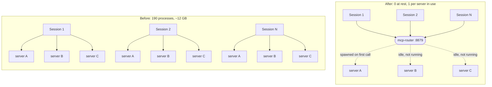
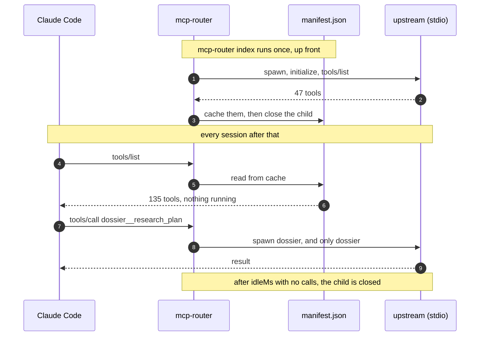
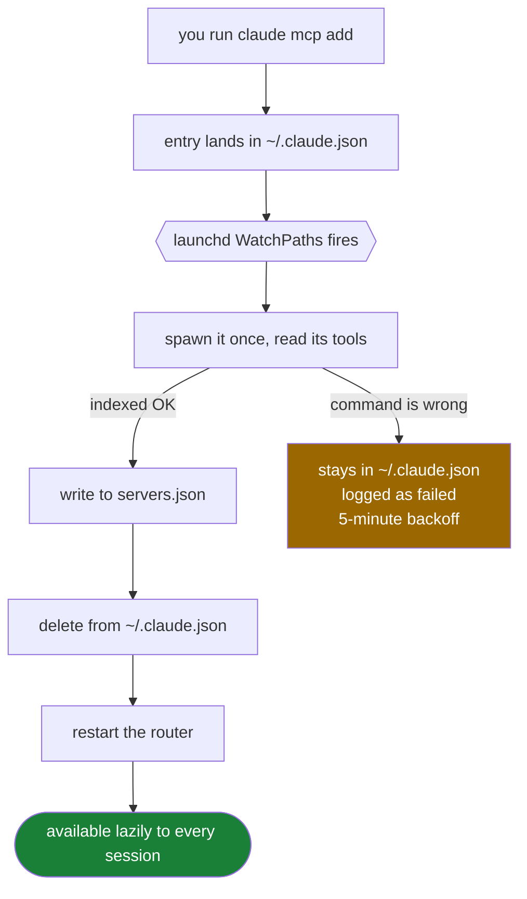

<div align="center">


# mcp-router

**One HTTP MCP endpoint that every Claude Code session shares, which starts a server only when a tool on it is actually called.**

[](#install)
[](#install)
[](#install)
[](https://modelcontextprotocol.io)
[](LICENSE)

</div>

---

## Why this exists

Ten Claude Code sessions were running on my Mac with twelve MCP servers configured. That produced **~190 MCP server processes** and **~12 GB of combined RSS**, and most of those servers were never called once.

That's not a misconfiguration; it's the protocol. **stdio MCP is a 1:1 pipe.** One client, one server process, no multiplexing anywhere in the spec. So ten sessions with twelve servers means up to 120 processes, and every one of them starts at session init whether the session ever touches it or not.

Nothing in Claude Code's config fixes it. `--strict-mcp-config` reduces how many servers a session *declares*, but each declared server still starts eagerly and nothing is shared between sessions. There's no lazy-start option to reach for: the per-server schema accepts `command`, `args`, `env`, `type`, `url`, `headers` and `timeout`, and none of those defer a spawn.

Pooling exists at exactly one place in the spec, and that's the **HTTP transport**. So the router speaks HTTP to Claude Code and stdio to the servers.

On this machine now: **135 tools from 11 upstreams, with 0 child processes running at rest.**



---

## Install

```bash
git clone https://github.com/fledgeling-co/mcp-router.git && cd mcp-router && ./scripts/install.sh
```

That builds the router, copies your stdio servers out of `~/.claude.json`, indexes them once, writes two launchd agents with this machine's own absolute paths, loads them, and adds a single `router` entry to `~/.claude.json`. It backs that file up first.

Start a new Claude Code session afterwards; a running session fetches its tool list once at init and won't see the change.

**Note:** the installer is macOS-only because it uses launchd. On Linux, `npm run build` then run `node dist/index.js serve` under systemd; everything else in the router is platform-neutral.

### Uninstall

```bash
./scripts/uninstall.sh          # restore your servers, remove the agents
./scripts/uninstall.sh --purge  # ...and delete ~/.claude/mcp-router as well
```

The restore is the half that matters. Every stdio server the router adopted is written back into `~/.claude.json` before the agents go, so you're left with a working setup rather than no MCP servers at all. It won't overwrite a name you've since defined by hand.

---

## How it works

The awkward part is `tools/list`. A client needs the full tool list at startup, and the only way to learn an stdio server's tools is to start it and ask; that's the exact cost being removed. So the router **caches the tool manifest to disk**.



The cache is keyed on each server's `command`/`args`/`env` identity, so editing one server invalidates only its own entry. Tools are namespaced `<server>__<tool>` so two servers can't collide.

Spawns are single-flighted, so two concurrent calls to a cold server produce one child rather than two.

---

## Adding a server

Add it the ordinary way. The watcher does the rest.

```bash
claude mcp add --scope user my-server -- /path/to/cmd --flag
```

**It will look like it vanished.** Within seconds the entry disappears from `~/.claude.json`, and that's the watcher working rather than a bug.



Confirm with `mcpr tools | grep my-server`, and `~/.claude/mcp-router/watch.log` records every adoption.

**The order is deliberate: it indexes first and adopts only on success.** A server whose command is wrong stays in `~/.claude.json`, is logged as failed, and never enters `servers.json`; a typo stays visible where you typed it instead of being swallowed into a config that can't serve it.

Three things the watcher deliberately leaves alone:

| Not adopted | Why |
|---|---|
| HTTP/SSE entries | They already pool on their own transport and carry their own OAuth; another hop would strip that context |
| The `router` entry itself | It would proxy to itself |
| Project scope (`.mcp.json`) and local scope | Deliberately scoped to one repo; that's the point of them |

`~/.claude.json` is ~268 KB, holds live session state for every project, and Claude Code rewrites it constantly. So the watcher hashes **only** the `mcpServers` object and exits in about 100 ms when it's unchanged, which is nearly every fire. It backs the file up before writing, writes via temp file plus rename, re-reads immediately before writing so concurrent session state survives, and abandons the run without writing anything if the parse fails.

---

## Operating it

```bash
mcpr status          # what is running right now, and how long it has been idle
mcpr tools           # the namespaced tool list, from cache
mcpr index --force   # rebuild the whole cache
mcpr serve --verbose # foreground, with child stderr
mcpr watch --verbose # run one watcher pass by hand
```

Endpoints: `/mcp`, `/health`, `/status`.

**Changing** a server is the one case that isn't automatic, since the watcher only reacts to new entries:

```bash
mcpr import && mcpr index
```

A re-index reaches the running router without a restart: `serve` stats the manifest on each `tools/list` and re-reads it when the mtime moves, keeping the previous manifest if the new one won't parse. Adding a *new* upstream is the one change that needs a restart, because the upstream list is read once at startup, and the watcher does that restart itself.

---

## What it deliberately doesn't do

- **It doesn't proxy HTTP/SSE upstreams.** Those are already shared endpoints with their own auth; routing them through here adds a hop and strips their OAuth context.
- **It doesn't bind beyond loopback.** This endpoint runs every MCP server you own, with your environment. It must not be reachable from the network.
- **It doesn't proxy prompts or resources**, only tools.
- **It doesn't cover Claude Desktop.** That app's per-server schema requires `command` and has no `url` or `type` field, so an HTTP entry fails validation and gets dropped with a "Some MCP servers could not be loaded" dialog. Remote servers reach Desktop through Settings > Connectors instead.

---

## The trade it makes

Worth being straight about, because it's a real one. **One process now sits in front of every MCP server you have**, and since the cutover it's the only path Claude Code has to them rather than an opt-in one. If it dies, every session loses every tool at once, where before a failure was isolated to one server in one session.

`KeepAlive` in the plist is what covers that, and `~/.claude/mcp-profiles/*.json` with `--strict-mcp-config` is the way back to direct stdio if you ever need it.

A dead or broken upstream returns a JSON-RPC tool error naming the server. It doesn't propagate; one broken server can't take the other ten down, and the router stays up. That's verified against `docker-mcp` with the Docker engine stopped.

**One launchd trap, measured rather than theorised:** do not set `ProcessType: Background` in either plist. It throttles startup I/O hard enough that the process never reaches `listen()`, while `launchctl` reports the agent running the whole time with an empty log. It looks exactly like a hang.

---

## Tests

```bash
node scripts/e2e.mjs
```

Nine checks against a running router using the SDK's own client, which is the same one Claude Code uses: initialize, `tools/list` served from cache, namespacing, `tools/call`, that the called upstream started, **that no other upstream started**, and that an unknown server errors without crashing the router.

---

## Documentation map

| File | What it covers |
|---|---|
| `src/manifest.ts` | The tool cache and its reload semantics; why lazy spawning is possible at all |
| `src/pool.ts` | Child lifecycle: single-flight spawn, idle reaping |
| `src/router.ts` | The stateless HTTP layer and how a dead upstream is contained |
| `src/watch.ts` | The adoption watcher and its refusal behaviour |
| `scripts/install.sh` | What the one-liner actually does, in order |

---

## Design


The mark is a manifold: cool glass conduits converge from the left into one hub, and on the right exactly one branch is lit while the others sit dormant. Many-to-one on the way in, lazy-wake on the way out, which is the whole program in one shape.

It lives in `design/icon/`, alongside the layered SVG master, its build script, the alternate takes, and `audit.html`, where every take is scored against the 12-point macOS icon rubric at 128 / 64 / 48 / 32 / 16, losers included with the reason they lost.

<br clear="left" />

---

<div align="center">
<sub>Built by <a href="https://github.com/fledgeling-co">fledgeling</a>. MIT licensed.</sub>
</div>
