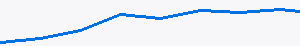

   

# trawl

Mine your own past agent sessions for evidence about what happened, what you asked for, and when a
decision was actually made. It reads the session stores already on your Mac; it **never** uploads
them. Its home is [the fledgeling marketplace](https://github.com/fledgeling-co/fledgeling-plugins).

> Built because "I know I asked for this three weeks ago" is a claim you should be able to check
> rather than argue about.

## What it reads

| Harness | Store | Format |
|---|---|---|
| Claude Code | `~/.claude/history.jsonl` | JSON Lines |
| Cursor | `~/.cursor/chats/` | JSON |
| Grok | `~/.grok/sessions/` | JSON Lines |
| Codex | `~/.codex/history.jsonl` | JSON Lines · SQLite |

## Use

```bash
trawl "parity gate" --since 2026-08-01 --harness claude
trawl --decisions --project mcp-router
trawl --export findings.md
```

### Flags worth knowing

- `--decisions` — only turns where something was settled, not every mention.
- `--verbatim` — return the original text rather than a summary.
- `--since` / `--until` — dates are read in your own timezone.

## What it will not do

1. Read a session store outside the paths listed above.
2. Write to any of them.
3. Send an excerpt anywhere. Summarising runs through a CLI you are already signed into.



---

MIT licensed. Attribution appreciated, not required.
